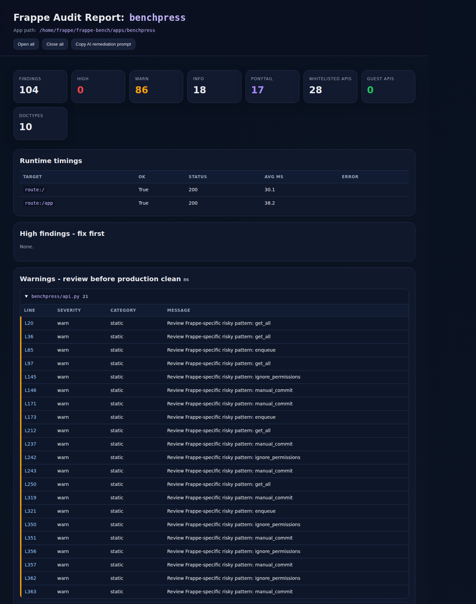

# Frappe Testing Loop

**AI-friendly audit and validation loop for Frappe/ERPNext apps.**

Frappe Testing Loop scans a Frappe app, discovers whitelisted APIs, highlights risky framework patterns, runs optional route/API smoke checks, and generates standalone reports that are useful for both developers and AI coding agents.

<p align="center">
  
</p>

<p align="center">
  <sub>Compact preview. Full report screenshots and generated reports can be opened locally as HTML.</sub>
</p>

---

## Why this exists

Frappe apps are rarely validated well by one generic command. A useful review loop needs to answer practical questions:

- Which whitelisted APIs does the app expose?
- Are there public guest APIs?
- Are custom APIs duplicating standard Frappe REST/resource APIs?
- Did code introduce risky patterns such as raw SQL, manual commits, or permission bypasses?
- Do important routes and whitelisted methods respond?
- Are native Frappe tests still passing?
- Can an AI agent inspect exact file/line findings and fix issues safely?

Frappe Testing Loop provides that glue:

```text
audit → inspect → fix → native tests → HTML report → repeat
```

---

## Core capabilities

### Static Frappe audit

- `@frappe.whitelist()` API discovery
- `allow_guest=True` discovery
- duplicate whitelisted API names/paths
- `ignore_permissions=True`
- `ignore_mandatory=True`
- `frappe.db.commit()` manual commits
- raw SQL usage
- broad `except Exception`
- `frappe.enqueue`
- heavy `frappe.get_all` review points
- DocType JSON inventory
- `hooks.py`, `doc_events`, and `scheduler_events`

### Ponytail-style simplification review

Inspired by [DietrichGebert/ponytail](https://github.com/DietrichGebert/ponytail), this review layer asks:

> Before writing or keeping custom code, can Frappe, Python stdlib, or existing app code already do this?

It flags review points such as:

- custom `get_*`, `list_*`, `create_*`, and `delete_*` APIs that may be replaceable by standard Frappe resource APIs
- custom cache/retry/HTTP/JSON helpers
- large files
- weak `ponytail:` debt comments without revisit triggers

Ponytail findings are **not automatic failures**. They are prompts for simplification.

### Runtime smoke checks

When a Frappe site is running, the tool can time:

- regular routes such as `/` and `/app`
- whitelisted methods via `/api/method/<dotted.path>`

### Native Frappe test companion

This tool does **not** replace Frappe tests. Use it alongside:

```bash
bench --site <site> set-config allow_tests true
bench --site <site> run-tests --app <app> --failfast
bench --site <site> migrate
```

---

## Installation

### Run from source

```bash
git clone https://github.com/Venkateshvenki404224/frappe-testing-loop.git
cd frappe-testing-loop
python3 -m frappe_testing_loop.audit --help
```

### Editable install

```bash
pip install -e .
frappe-testing-loop --help
# or
frappe-audit --help
```

The current CLI has no required third-party Python dependencies.

---

## Quick start: local bench

```bash
python3 -m frappe_testing_loop.audit \
  --bench /home/frappe/frappe-bench \
  --app my_app \
  --site mysite.localhost \
  --base-url http://localhost:8000 \
  --route / \
  --route /app
```

By default, every run creates a unique ignored report folder under:

```text
skills/frappe-testing-loop/reports/<YYYYMMDD-HHMMSS>-<app>-<id>/
```

The folder contains:

```text
audit.html   # browser/AI-readable report
audit.json   # machine-readable payload with score block
review.md    # Markdown review notes
issue.md     # GitHub-ready alert body, only when status is fail/review
```

The parent `reports/` folder also gets an ignored append-only history file:

```text
results.tsv  # timestamp, app, run_dir, score, status, finding counts
```

Open the latest HTML report:

```bash
xdg-open skills/frappe-testing-loop/reports/<run-folder>/audit.html
```

---

## Scheduled alerts and GitHub issues

For daily cron/CI loops, let the audit write both files and GitHub issue updates:

```bash
python3 -m frappe_testing_loop.audit \
  --bench /home/frappe/frappe-bench \
  --app my_app \
  --site mysite.localhost \
  --base-url http://localhost:8000 \
  --route /app \
  --github-issue \
  --github-repo owner/repo
```

Behavior:

- `pass`: writes normal reports/history only.
- `review` or `fail`: writes `issue.md` inside the run folder.
- With `--github-issue`, creates one stable open issue titled `[Frappe Testing Loop] <app> audit requires attention`.
- If that issue already exists, the loop comments on it instead of creating duplicate daily issues.

Use `--attention-file /path/to/issue.md` to write the alert body somewhere specific without GitHub. Use `--github-dry-run` to verify the issue payload without calling `gh`.

---

## Quick start: Docker/Frappe container

If the Frappe app files exist inside a backend container, copy the audit script into the container and run it there.

Example from a BenchPress-style dev setup:

```bash
docker cp frappe_testing_loop/audit.py benchpress_backend:/tmp/frappe_app_audit.py

docker exec benchpress_backend bash -lc '
python3 /tmp/frappe_app_audit.py \
  --bench /home/frappe/frappe-bench \
  --app benchpress \
  --site frontend \
  --base-url http://benchpress_frontend:8080 \
  --route / \
  --route /app \
  --json /tmp/benchpress-audit.json \
  --html /tmp/benchpress-audit.html
'

docker cp benchpress_backend:/tmp/benchpress-audit.html ./benchpress-audit.html
docker cp benchpress_backend:/tmp/benchpress-audit.json ./benchpress-audit.json
```

---

## Authenticated API checks

Pass whitelisted method names using repeated `--endpoint` flags.

```bash
python3 -m frappe_testing_loop.audit \
  --bench /home/frappe/frappe-bench \
  --app my_app \
  --site mysite.localhost \
  --base-url http://localhost:8000 \
  --username Administrator \
  --password 'admin' \
  --endpoint my_app.api.get_dashboard \
  --endpoint my_app.api.list_devices \
  --repeat 3
```

The runtime table records:

- target
- status code
- success/failure
- average response time
- error text, if any

---

## AI agent integrations

Frappe Testing Loop is packaged for humans and AI coding agents.

### Install as a Claude Code plugin

Inside Claude Code, run these slash commands:

```text
/plugin marketplace add Venkateshvenki404224/frappe-testing-loop
/plugin install frappe-testing-loop@frappe-testing-loop
```

Then use the plugin skill:

```text
/frappe-testing-loop:frappe-testing-loop
```

If Claude Code cannot access the private repository, authenticate GitHub first with `gh auth login` or start Claude Code with `GITHUB_TOKEN`/`GH_TOKEN` available.

### Integration files

| Integration | Path |
|---|---|
| Claude marketplace catalog | `.claude-plugin/marketplace.json` |
| Claude plugin manifest | `plugins/frappe-testing-loop/.claude-plugin/plugin.json` |
| Claude Code project skill | `.claude/skills/frappe-testing-loop/SKILL.md` |
| Canonical Agent Skill | `skills/frappe-testing-loop/SKILL.md` |
| Codex repository skill | `.agents/skills/frappe-testing-loop/SKILL.md` |
| Codex plugin manifest | `.codex-plugin/plugin.json` |
| Distributable plugin folder | `plugins/frappe-testing-loop/` |
| Generic agent instructions | `AGENTS.md` |

See [`docs/agent-integrations.md`](docs/agent-integrations.md) for full installation and usage details.

Recommended agent loop:

```text
research context → run audit → inspect report → fix smallest useful issue → run native tests → rerun audit → summarize verified evidence
```

---

## Report output

Example summary payload:

```json
{
  "findings": 104,
  "high": 0,
  "warn": 86,
  "info": 18,
  "ponytail": 17,
  "whitelisted_apis": 28,
  "guest_apis": 0,
  "doctypes": 10
}
```

| Field | Meaning |
|---|---|
| `findings` | Total number of observations |
| `high` | Serious blockers; fix first |
| `warn` | Risky/review-worthy patterns |
| `info` | Informational notes |
| `ponytail` | Simplification/reuse opportunities |
| `whitelisted_apis` | APIs exposed with `@frappe.whitelist()` |
| `guest_apis` | Public APIs using `allow_guest=True` |
| `doctypes` | DocTypes found in the app |

Generated HTML reports include:

- summary cards
- quality score cards
- runtime timings
- high findings
- warnings grouped by file
- Ponytail findings grouped by file
- info findings
- whitelisted API inventory
- DocType inventory
- AI remediation instructions
- raw JSON payload

---

## CLI reference

```bash
python3 -m frappe_testing_loop.audit --help
```

Important flags:

| Flag | Purpose |
|---|---|
| `--bench` | Path to `frappe-bench` |
| `--app` | Frappe app name |
| `--site` | Site name |
| `--base-url` | Running site URL |
| `--route` | Route to time; repeatable |
| `--endpoint` | Whitelisted API method to time; repeatable |
| `--username` / `--password` | Login for authenticated checks |
| `--repeat` | Number of HTTP timing repeats |
| `--include-tests` | Include test files in static scan |
| `--no-ponytail` | Disable Ponytail layer |
| `--json` | Write machine-readable JSON |
| `--md` | Write Markdown report |
| `--html` | Write standalone HTML report |
| `--reports-dir` | Override the base directory for automatic per-run report folders |
| `--no-default-reports` | Disable automatic `audit.html`, `audit.json`, and `review.md` generation |
| `--attention-file` | Write GitHub-ready issue Markdown when status is `fail`/`review` |
| `--no-auto-attention-file` | Disable automatic `issue.md` in automatic report folders |
| `--github-issue` | Create/update a GitHub issue through `gh` when status is `fail`/`review` |
| `--github-repo` | Target repo for `--github-issue`, e.g. `owner/repo` |
| `--github-label` | Comma-separated labels to apply when creating a new GitHub issue |
| `--github-dry-run` | Build issue payload without calling GitHub |

If `--json`, `--md`, and `--html` are all omitted, the CLI automatically writes all three files to a unique folder inside `skills/frappe-testing-loop/reports/`. Generated report folders are ignored by Git; only `.gitkeep` is tracked.

---

## Project structure

```text
frappe-testing-loop/
├── frappe_testing_loop/        # Python audit CLI
├── skills/                     # Canonical Agent Skill package
├── .claude/skills/             # Claude Code project skill
├── .agents/skills/             # Codex repository skill
├── plugins/frappe-testing-loop # Distributable plugin package
├── docs/                       # Architecture and integration docs
└── examples/                   # Example report output
```

---

## Project status

Alpha. The framework is already useful for manual and agent-assisted Frappe app testing. Rules and integrations will evolve based on real-world Frappe/ERPNext apps.

## License

MIT
