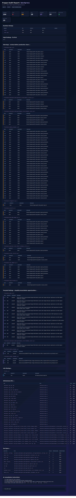

# Frappe Testing Loop

A lightweight testing/audit loop for Frappe and ERPNext apps.

It scans a Frappe app, discovers whitelisted APIs, highlights risky Frappe patterns, applies a Ponytail-style simplification review, optionally checks live routes/API speed, and generates a **standalone HTML report** that both humans and AI coding agents can understand.



## Why this exists

Frappe apps are not tested well by a single command. A useful loop needs to answer multiple questions:

- Did the code introduce risky Frappe patterns?
- Are APIs already present somewhere in the codebase?
- Are there guest APIs?
- Are custom APIs duplicating standard Frappe REST/resource APIs?
- Do important routes or whitelisted methods respond?
- How fast are routes/APIs?
- Do native Frappe tests still pass?
- Can a human quickly understand the result?
- Can an AI agent inspect exact file/line findings and fix them?

Frappe Testing Loop is meant to be that glue.

## What it checks

### Static Frappe audit

- `@frappe.whitelist()` API discovery
- `allow_guest=True` discovery
- duplicate whitelisted API names/paths
- `ignore_permissions=True`
- `frappe.db.commit()` manual commits
- raw SQL usage
- broad `except Exception`
- `frappe.enqueue`
- heavy `frappe.get_all` review points
- DocType JSON inventory
- `hooks.py`, `doc_events`, and `scheduler_events`

### Ponytail review layer

Inspired by [DietrichGebert/ponytail](https://github.com/DietrichGebert/ponytail), this layer asks:

> Before writing or keeping custom code, can Frappe, Python stdlib, or existing app code already do this?

It flags review points like:

- custom `get_*`, `list_*`, `create_*`, `delete_*` APIs that might be standard Frappe resource calls
- custom cache/retry/HTTP/JSON helpers
- large files
- weak `ponytail:` debt comments without revisit triggers

Ponytail findings are **not automatic failures**. They are simplification prompts.

### Runtime smoke checks

When a Frappe site is running, it can time:

- regular routes like `/` and `/app`
- whitelisted API methods through `/api/method/<dotted.path>`

### Native Frappe tests

This tool does not replace Frappe tests. Use it with:

```bash
bench --site <site> set-config allow_tests true
bench --site <site> run-tests --app <app> --failfast
bench --site <site> migrate
```

## Agent integrations

Frappe Testing Loop is now packaged for AI coding agents as well as humans:

- **Claude Code skill:** `.claude/skills/frappe-testing-loop/SKILL.md`
- **Codex skill:** `.agents/skills/frappe-testing-loop/SKILL.md`
- **Canonical Agent Skill:** `skills/frappe-testing-loop/SKILL.md`
- **Claude/Codex plugin manifests:** `.claude-plugin/plugin.json`, `.codex-plugin/plugin.json`
- **Distributable plugin folder:** `plugins/frappe-testing-loop/`
- **Generic agent instructions:** `AGENTS.md`

See [`docs/agent-integrations.md`](docs/agent-integrations.md) for installation and usage details.

## Install

### Run directly from source

```bash
git clone https://github.com/Venkateshvenki404224/frappe-testing-loop.git
cd frappe-testing-loop
python3 -m frappe_testing_loop.audit --help
```

### Optional editable install

```bash
pip install -e .
frappe-testing-loop --help
# or
frappe-audit --help
```

No third-party Python dependencies are required for the current CLI.

## Quick start: local bench

```bash
python3 -m frappe_testing_loop.audit \
  --bench /home/frappe/frappe-bench \
  --app my_app \
  --site mysite.localhost \
  --base-url http://localhost:8000 \
  --route / \
  --route /app \
  --json reports/my-app-audit.json \
  --html reports/my-app-audit.html
```

Open:

```bash
xdg-open reports/my-app-audit.html
```

## Quick start: Docker/Frappe container

If your app files exist inside the backend container, copy the script into the container and run it there.

Example from the BenchPress dev setup:

```bash
docker cp frappe_testing_loop/audit.py benchpress_backend:/tmp/frappe_app_audit.py

docker exec benchpress_backend bash -lc '
python3 /tmp/frappe_app_audit.py \
  --bench /home/frappe/frappe-bench \
  --app benchpress \
  --site frontend \
  --base-url http://benchpress_frontend:8080 \
  --route / \
  --route /app \
  --json /tmp/benchpress-audit.json \
  --html /tmp/benchpress-audit.html
'

docker cp benchpress_backend:/tmp/benchpress-audit.html ./benchpress-audit.html
```

Then open `benchpress-audit.html` in your browser.

## Authenticated API checks

Pass whitelisted method names using repeated `--endpoint` flags.

```bash
python3 -m frappe_testing_loop.audit \
  --bench /home/frappe/frappe-bench \
  --app my_app \
  --site mysite.localhost \
  --base-url http://localhost:8000 \
  --username Administrator \
  --password 'admin' \
  --endpoint my_app.api.get_dashboard \
  --endpoint my_app.api.list_devices \
  --repeat 3 \
  --html reports/api-smoke.html
```

The runtime table records:

- target
- status code
- success/failure
- average response time
- error text, if any

## Official Frappe test command

Run this after the audit:

```bash
bench --site <site> set-config allow_tests true
bench --site <site> run-tests --app <app> --failfast
```

For Docker:

```bash
docker exec <backend-container> bash -lc '
cd /home/frappe/frappe-bench
bench --site <site> set-config allow_tests true
bench --site <site> run-tests --app <app> --failfast
'
```

## Report meanings

Example summary:

```json
{
  "findings": 104,
  "high": 0,
  "warn": 86,
  "info": 18,
  "ponytail": 17,
  "whitelisted_apis": 28,
  "guest_apis": 0,
  "doctypes": 10
}
```

| Field | Meaning |
|---|---|
| `findings` | Total number of observations |
| `high` | Serious blockers; fix first |
| `warn` | Risky/review-worthy patterns |
| `info` | Informational notes |
| `ponytail` | Simplification/reuse opportunities |
| `whitelisted_apis` | APIs exposed with `@frappe.whitelist()` |
| `guest_apis` | Public APIs using `allow_guest=True` |
| `doctypes` | DocTypes found in the app |

## HTML report sections

The generated HTML includes:

- summary cards
- runtime timings
- high findings
- warnings grouped by file
- Ponytail findings grouped by file
- info findings
- whitelisted API inventory
- DocType inventory
- AI remediation instructions
- raw JSON payload

## AI remediation workflow

Use the HTML/JSON report as the input to an AI coding agent:

1. Fix `high` findings first.
2. Inspect exact file and line for each warning.
3. For Ponytail findings, check whether Frappe built-ins or existing app code already solves it.
4. Make the smallest useful change.
5. Rerun:

```bash
python3 -m frappe_testing_loop.audit ... --html reports/latest.html
bench --site <site> run-tests --app <app> --failfast
bench --site <site> migrate
```

This creates the loop:

```text
audit → inspect → fix → native tests → HTML report → repeat
```

## CLI reference

```bash
python3 -m frappe_testing_loop.audit --help
```

Important flags:

| Flag | Purpose |
|---|---|
| `--bench` | Path to `frappe-bench` |
| `--app` | Frappe app name |
| `--site` | Site name |
| `--base-url` | Running site URL |
| `--route` | Route to time; repeatable |
| `--endpoint` | Whitelisted API method to time; repeatable |
| `--username` / `--password` | Login for authenticated checks |
| `--repeat` | Number of HTTP timing repeats |
| `--include-tests` | Include test files in static scan |
| `--no-ponytail` | Disable Ponytail layer |
| `--json` | Write machine-readable JSON |
| `--md` | Write Markdown report |
| `--html` | Write standalone HTML report |

## Project status

Alpha. The framework is already useful for manual Frappe app testing, but rules will evolve based on real apps.

## License

MIT
